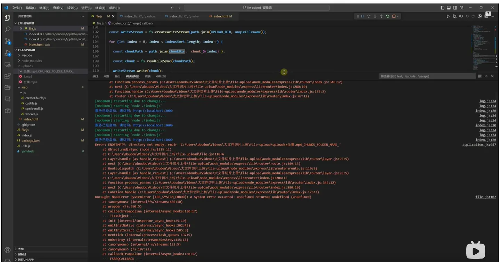
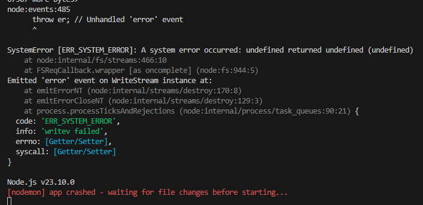
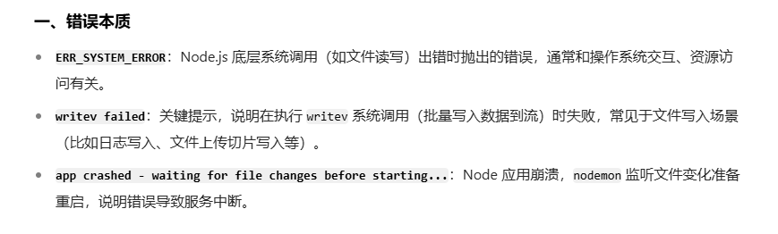
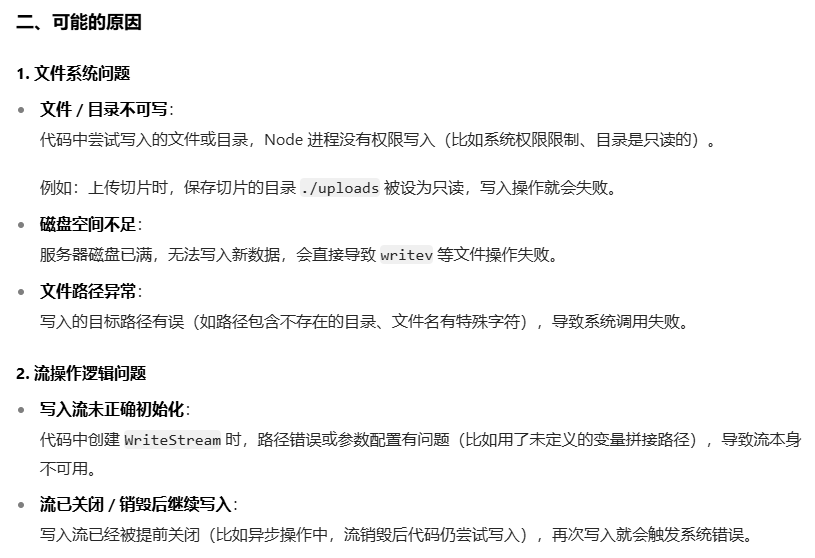
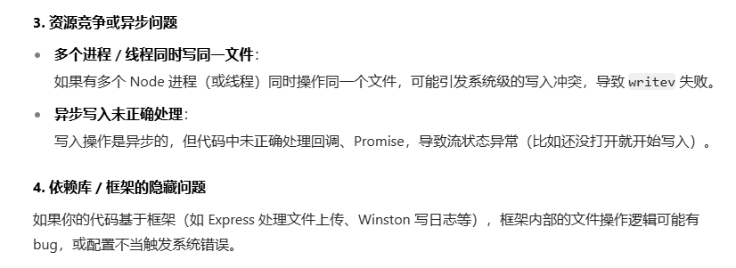

# 1.大文件上传

## 参考资料

- 文件上传案例( 没看)：
  ● https://github.com/shengxinjing/upload
  ● https://github.com/yeyan1996/file-upload

## webwork的知识：

● https://blog.csdn.net/liangshanbo1215/article/details/146421348
● https://web.dev/articles/off-main-thread?hl=zh-cn
● https://developer.mozilla.org/zh-CN/docs/Web/API/Web_Workers_API

- 重点注意：
  - Web Worker 运行在独立的线程中，与主线程完全隔离。
  - 消息通信：主线程和 Worker 线程之间通过 postMessage 和 onmessage 进行通信。
  - Dedicated Worker：由主线程创建，且只能与创建它的主线程通信。
  - Shared Worker：可以被多个脚本共享，甚至来自不同的窗口、iframe 或 Worker。
  - Service Worker：主要用于离线缓存、推送通知等场景。
    - 计算密集型任务：图像处理：如图像滤镜、压缩、裁剪等；数据分析：如大数据排序、统计、可视化等；复杂算法：如加密解密、机器学习模型推理等；`定时任务：如定时检查更新、定时发送请求等；文件处理：如大文件的分片上传或下载。`
    - `无 DOM 访问权限：Worker 线程无法直接访问 DOM、window 对象或 document 对象，因为它们不是线程安全的。`

## 为啥使用web worker

&emsp;&emsp;总结：前端文件上传，最主要的消耗时间就是在把文件进行**hash转换的过程中**。

1. 不使用 Web Worker 的潜在问题

- 超大切片在计算hash转换会引起页面卡顿（切片大小增加到 50MB 以上）；比如输入框输入会卡顿；例如：在计算 hash 的同时滚动页面，可能出现滚动不流畅、延迟响应的现象。
- 整个文件/所有切片计算hash时，文件越大越慢。
- 占用主线程：hash 计算会与这些操作争夺主线程资源，导致整体性能下降。
- 阻塞后面的逻辑

2. Web Worker 的核心价值：稳定性与效率

- Web Worker 中的 hash 计算在独立线程执行，无论计算耗时多长，都不会占用主线程资源，确保 UI 始终流畅响应。
- Web Worker 可以将多个切片的 hash 计算分配到不同线程，并行处理，从而缩短总计算时间（尤其对超大文件优势明显）。

## Promise 异步操作导致卡顿 与 “主线程阻塞逻辑” 的区别

&emsp;&emsp;核心结论是：`Promise 本身不会直接导致卡顿，但如果异步操作内部包含大量同步计算（或阻塞主线程的逻辑），则会引发页面卡顿。`Promise.all/ Promise.allSettled 本身只是 “等待多个 Promise 完成后统一处理结果”，它们的 “等待过程” 不会阻塞主线程；`但Promise 内部的逻辑（尤其是同步计算）和 “结果处理回调” 的逻辑，才是决定是否卡顿的关键。`

- `卡顿的真正原因：Promise 内部或回调中包含 “长时间占用主线程的同步逻辑”（CPU 密集型任务）；`
- `解决方案：IO 密集型任务可直接用 Promise 并行处理；CPU 密集型任务需用 Web Worker 移到后台线程，或拆分任务避免阻塞主线程。`

### 先明确两个核心概念

1. `Promise 的本质是 “异步任务调度器”，而非 “多线程”`
   浏览器 / Node.js 中，Promise 的 then/catch/finally 回调、以及 Promise.all/Promise.allSettled 的 “等待逻辑”，全部运行在主线程中（JS 是单线程语言，没有真正的多线程执行）。
   它们的 “异步” 体现在：等待异步任务（如网络请求、定时器）完成后，将回调放入 “微任务队列”，待主线程执行，而非阻塞主线程等待。
2. `页面卡顿 的根源：主线程被长时间占用`
   浏览器的主线程负责三件核心事：执行 JS 代码、处理 DOM 渲染、响应用户交互（如点击、滚动）。这三件事是 “串行执行” 的 —— 如果 JS 代码执行时间超过 16ms（对应 60fps 刷新率的每帧时长），就会阻塞 DOM 渲染和用户交互，表现为页面卡顿、点击无响应等。

### 分场景判断：是否会导致卡顿？

1. 处理 “IO 密集型任务”（如网络请求、本地存储）→ 不会卡顿
   最常见的场景：用 Promise.all 并行发起多个网络请求（如接口调用、图片加载），或读取本地存储（localStorage）。
   ● 这类任务的核心是 “等待外部响应”（如等待服务器返回数据），等待期间主线程是空闲的（会去处理渲染、用户交互）；
   ● 只有当外部响应返回后，Promise 的回调（如 then 里处理接口数据）才会进入微任务队列，待主线程空闲时执行 —— 只要回调里没有大量同步计算，就不会卡顿。

```js
// 并行发起3个接口请求（IO任务，等待期间主线程空闲）
const fetchUsers = fetch('/api/users')
const fetchPosts = fetch('/api/posts')
const fetchComments = fetch('/api/comments')

// 等待所有请求完成后处理数据（回调逻辑简单，不阻塞）
Promise.all([fetchUsers, fetchPosts, fetchComments])
  .then(responses => Promise.all(responses.map(r => r.json())))
  .then(([users, posts, comments]) => {
    // 简单的DOM更新（如渲染列表），耗时极短
    renderUsers(users)
    renderPosts(posts)
  })
```

2. 处理 “CPU 密集型任务”（如大量同步计算）→ 会导致卡顿
   &emsp;&emsp;如果 Promise 内部包含大量同步计算（如循环遍历 10 万条数据、复杂数学运算、大文件解析），或 Promise.all 的结果处理回调里有 heavy 逻辑，这`些同步代码会持续占用主线程，阻塞渲染和交互。`
   此时，无论用 Promise.all 还是 Promise.allSettled，都无法避免卡顿 —— 因为问题根源是 `“主线程被同步计算占用”，而非 Promise 本身。`代码中，3 个 heavyTask 里的同步循环会依次占用主线程（JS 单线程，Promise 无法并行执行同步代码），总耗时可能超过 100ms，导致页面卡顿。

```js
// 模拟“CPU密集型任务”：同步计算10万次循环（耗时数百毫秒）
function heavyTask(num) {
  return new Promise(resolve => {
    // 注意：这里的计算是同步的！会直接占用主线程
    let sum = 0
    for (let i = 0; i < 100000; i++) {
      sum += i * num
    }
    resolve(sum)
  })
}

// 并行执行3个heavyTask（本质是“同步计算的串行叠加”）
Promise.all([heavyTask(1), heavyTask(2), heavyTask(3)]).then(results => {
  // 回调里再做大量计算，进一步阻塞
  const final = results.reduce((a, b) => a * b, 1)
  console.log(final)
})
```

3. 如何避免 Promise 相关的页面卡顿？
   &emsp;&emsp;`把 CPU 密集型任务从主线程 “移走”，避免长时间占用主线程。`

- `用 Web Worker 处理 CPU 密集型任务`
- `拆分同步任务，插入 “空闲时间”`:如果无法使用 Web Worker（如兼容性要求），可以将大量同步计算拆分成 “小块”，用 requestIdleCallback 或 setTimeout 让主线程在 “空闲时” 逐步执行，避免一次性占用过长时间。

## 在框架中使用web worker的注意事项

&emsp;&emsp;总结：要保证worker.js/ts/jsx/tsx脚本要被编译(webpack/vite使用对应的loader)成浏览器可以识别的js资源；注意路径问题，可以在浏览器的请求url中验证。

1.  Webpack 5+ 原生支持（推荐）
    
2.  Webpack 4 及以下（需使用 worker-loader）
    
3.  vite中（最新、这个使用过）

```js
const worker = new Worker(new URL('./utils/worker.ts', import.meta.url), { type: 'module' })
```

## 怎么计算整个hash及优化进度条、上传体验

- 方法：计算怎个文件的hash，先计算切片的hsh，然后在对得到的每个切片的hash进行字符串拼接，在计算hash
- 缺点：整体的hash计算很慢，
- 优化逻辑:
  看这里：https://github.com/liuchanglongs/-/blob/main/02.%20%E5%A4%A7%E6%96%87%E4%BB%B6%E4%B8%8A%E4%BC%A0%E5%9F%BA%E5%BB%BA/%E5%A4%A7%E6%96%87%E4%BB%B6%E4%B8%8A%E4%BC%A0.md#%E5%A6%82%E4%BD%95%E5%87%8F%E5%B0%91%E9%A1%B5%E9%9D%A2%E9%98%BB%E5%A1%9E

## 文件上传逻辑梳理

### 一些理解（重要）

1. 非阻塞上传：切一片就上传，减少用户等待的时间。
2. 切片：文件file有一个slice可以根据size进行切片。、唯一id、cpu的线程数
3. 唯一id（根据每一个文件的内容计算md5/hash）：后端拿到切片文件，对切片文件在进行md5计算，对比与前端的是否一样。防止在传输过程中被损坏。非常消耗内存，阻塞浏览器代码执行
4. 浏览器cpu的线程数：navigator.hardwareConcurrency 是一个浏览器 API 属性，用于返回当前设备的逻辑处理器核心数量（即 CPU 线程数）。这个值通常与设备的核心数相关，可用于优化多线程任务（如 Web Worker）的分配策略。
5. 接口并发的数量控制：浏览器对请求的并发是有限制的，多余这个限制会排队pending等待，我们一般设置1-3.一般后端会处理，对切片上传的接口并发数量进行控制，当前端直接切完文件就上传就会导致一下发起很多的请求，都处于pending的状态，很容易请求超时，所以前端也要做并发的控制。
6. 秒传：就是同一个文件上传的的切片不用再传。
7. 实际产品怎么区别是否是同一个文件/一个文件的独一无二的id：常用的做法是选取文件的前30M的内容，来对这30M的内容、文件大小做文件hash，结合文件用户的登录信息，比如用户名、用户id一起作为临时文件的存储路径，防止同名的问题。
8. 切片计算完就上传：减少用户等待的白屏，页面进度条反馈变快;缺点大量的切片接口被发起。

### 上传逻辑梳理

1. 切片大小CHUNK_SIZE、启用的线程个数THREAD_COUNT
2. 获取上传的切片（切片的索引uploadedChunks）

- 利用uid或者前30M的内容、文件大小做文件hash为这个文件上传的id
- 这里demo只对用自己上传过的文件做秒传，所以直接用file name为id。

- 目的上传的切片就不要传了、前端不做hash处理了。利用切片数量范伟生成的索引来判断。
- 要区别是否是同一个文件。

3. 计算切片数量totalChunks、计算并发上传数量；每个线程需要处理切片数量concurrentUploads

- 注意：向上取整

4. 根据THREAD_COUNT，计算出每个线程处理的切片范围，并启动webWork。

- 分配到最后一段，不能操作totalChunks
- 避免文件过小，开启空线程：

```js
if (totalChunks < end) {
  end = totalChunks
}
// 避免文件过小，开启空线程
if (start >= end) {
  return
}
```

2. 计算每个线程需要的切片数量
3. 计算每个线程在切片列表中start、end的位置
4. 每个线程启用一个web worker ->传递给worker数据、接收worker返回的数据、捕获worker错误
5. 每个线程进行切片：拿到当前的切片文件->读取文件->计算hash->返回参数->将所有的数据传(postMessage)给主线程
6. web worker中：

- 如果已经上传过了，就不需要再处理了
- 切片、hash处理

7. worker.onmessage开始上传切片、处理完切片就关闭当前web work

- 何时上传：切片返回的数据uploaded控制。已经上传设置为true

```js
{
  // 开始的size
  chunkStart: start,
  // 结束的size
  chunkEnd: end,
  // 第几个切片
  chunkIndex: index,
  chunkHash: md5,
  chunkBlob: blob,
  uploaded: false, // 是否上传过，
  isDoneThread:false // 当前线程是否工作完
}
```

- 何时关闭线程：完成的个数等与处理完个数时，isDoneThread为true,最后一个上传完就关闭

8. 合并文件：切片全部上传时调用合并（上传完成一个切片、已经上传过的切片的数量 === totalChunks）

- 第一种情况：最后一个切片上传，开始合并。
- 第二种情况: 最后一个切片上传，开始合并出错，重新上传、重试时，开始合并
- **注意**：不能用开启的线程数 === 关闭的线程数 ，来请求merge合并文件。线程走完了，不代表文件切片上传完了

9. 切片上传接口的并发数量的控制：useRequestQueue

- 等待队列queue、当前正在执行的请求数量activeCount
- 执行队列中的下一个请求、添加请求到队列addRequest、清空队列clearQueue

# 还没有实现 2. 进度条、暂停 3. 上传了一部分，下次上传，这部分秒传

# 后端搭建

## 环境

```js
  "dependencies": {
    "busboy": "^1.6.0",
    // "cors": "^2.8.5",
    "express": "^5.1.0",
    // "multer": "^2.0.2"
  },
  "devDependencies": {
    "nodemon": "^3.1.10"
  }
```

## 一些理解

1. 获取已经上传的文件: 切片索引来匹配是否合理.

- 只要要有一个字段（一个文件的独一无二的id）能区分是否为同一个文件就行。

## 逻辑梳理

1. 上传切片接口实现：

- 开始创建一个目录存放文件upload
- 在这个目录下创建一个临时的存放这些切片的目录：`${chunkFilename}_CHUNKS`
- 这个临时目录写入切片：`chunk_${chunkIndex}`

2. 合并文件：将临时目录文件下的切片，合成一个文件，并重命名，存放在upload下

- 1. 为啥重命名：防止与临时文件、目录与其它上传的文件名重复：一般重命名为name(1).mvp/`name(index++)`
- 2. **注意**：用户中断请求（在上传切片的时候刷新浏览器），有冗余的文件：一、文件正在上传，然后突然刷新、网络中断。重新上传，可能会合并失败。原因是可能后端在接收文件写在临时的目录中，切片文件没有写入完，请求就中断了。如果请求中断的时候不删除该文件，会导致合并的文件，出现破损，无法打开。二、有写入完（文件写入流没有结束），close方法不会调用，文件为占用状态，删除文件就会报错。

```js
req.on('aborted', () => {
  console.log('请求被客户端中断开始chunkPath:', chunkPath)
  console.log('请求被客户端中断开始writeStream:', writeStream)
  // 关闭未完成的写入流，避免文件残留
  if (writeStream && chunkPath) {
    writeStream.destroy()
    fsPromises
      .unlink(chunkPath)
      .then(res => {
        console.log('删除中断的分片res:', res)
      })
      .catch(err => {
        console.log('删除中断的分片err:', err)
      })
  }
})
```

- 3. 操作系统的原因：文件夹非空，不能直接删除文件夹，要递归删除文件，才能删除文件夹。
     
- 4. 前端切片上传：假如600个，中间断断续续出现CONNECTION_TIME_OUT,接口没打到后端：原因在multer写入文件的时候占满了文件缓存区
- 合并接口失败：
  
  
  
  
  &emsp;&emsp;Node.js 的 WriteStream 内部有一个缓冲区（内存中的临时存储区域）：当调用 writeStream.write(chunk) 时，数据会先进入缓冲区；缓冲区中的数据会被异步地写入磁盘（由 Node.js 底层处理）；如果缓冲区已满（比如写入速度超过磁盘处理速度），write() 方法会返回 false，表示暂时无法接受新数据。
  &emsp;&emsp;**解决**：流缓冲区满时，不写入文件，等待drain事件触发，再继续写入

```js
for (let index = 0; index < chunkFileNames.length; index++) {
  const sort = chunkFileNames[index]
  const chunkPath = path.join(chunksDir, CHUNKNAME_FN(sort))
  const chunk = await fsPromises.readFile(chunkPath)
  const isWrite = writeStream.write(chunk)
  if (!isWrite) {
    console.log('写入流缓冲区满时：isWrite:', isWrite)
    // 写入流缓冲区满时，等待drain事件
    await new Promise(resolve => writeStream.once('drain', resolve))
  }
}
```
