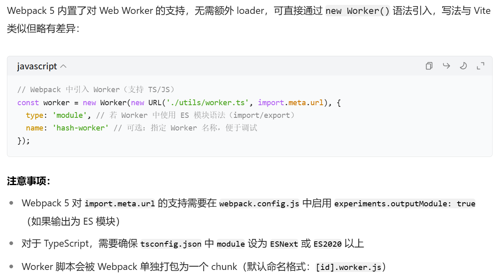
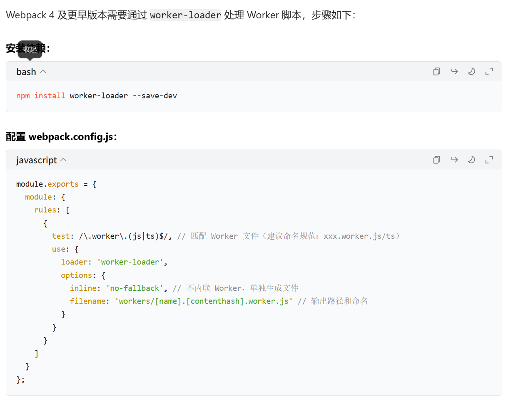
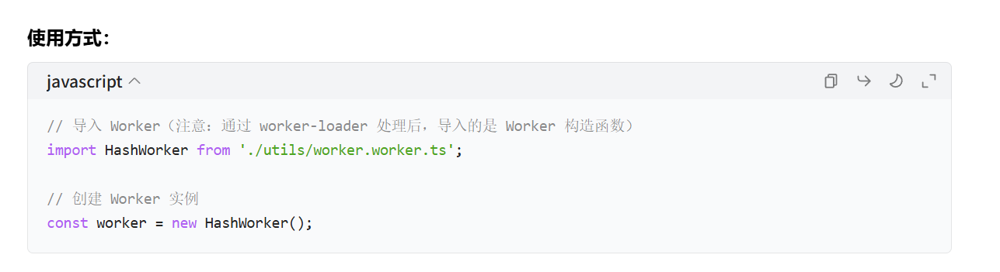
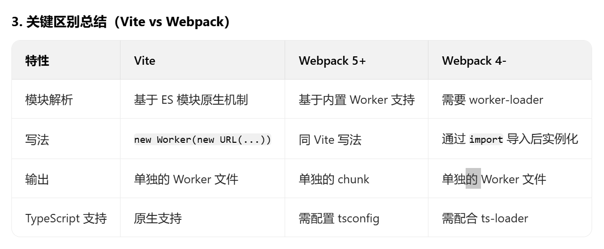

# 1.大文件上传

## 1.参考资料

- 文档资料
  https://juejin.cn/post/6844904055819468808
  https://juejin.cn/post/6844904046436843527

  https://juejin.cn/post/7224402365452238906

  https://juejin.cn/post/7308219810302738483#heading-10

  https://juejin.cn/post/7224402365452238906

- 文件上传案例：
  ● https://github.com/shengxinjing/upload
  ● https://github.com/yeyan1996/file-upload
- webwork的知识：
  ● https://blog.csdn.net/liangshanbo1215/article/details/146421348
  ● https://web.dev/articles/off-main-thread?hl=zh-cn
  ● https://developer.mozilla.org/zh-CN/docs/Web/API/Web_Workers_API

## 2.为啥使用web worker

&emsp;&emsp;总结：前端文件上传，最主要的消耗时间就是在把文件进行hash转换的过程中。

1. 不使用 Web Worker 的潜在问题

- 超大切片在计算hash转换会引起页面卡顿（切片大小增加到 50MB 以上）；比如输入框输入会卡顿；例如：在计算 hash 的同时滚动页面，可能出现滚动不流畅、延迟响应的现象。
- 整个文件/所有切片计算hash时，文件越大越慢。
- 占用主线程：hash 计算会与这些操作争夺主线程资源，导致整体性能下降。

2. Web Worker 的核心价值：稳定性与效率

- Web Worker 中的 hash 计算在独立线程执行，无论计算耗时多长，都不会占用主线程资源，确保 UI 始终流畅响应。
- Web Worker 可以将多个切片的 hash 计算分配到不同线程，并行处理，从而缩短总计算时间（尤其对超大文件优势明显）。

## 3.在框架中使用web worker的注意事项

&emsp;&emsp;总结：要保证worker.js/ts/jsx/tsx脚本要被编译(webpack/vite使用对应的loader)成浏览器可以识别的js资源；注意路径问题，可以在浏览器的请求url中验证。

1.  Webpack 5+ 原生支持（推荐）
    
2.  Webpack 4 及以下（需使用 worker-loader）
    
3.  vite中（最新、这个使用过）

```js
const worker = new Worker(new URL('./utils/worker.ts', import.meta.url), { type: 'module' })
```

4. 总结
   

文件上传

1. 非阻塞上传：切一片就上传，减少用户等待的时间/每个线程处理完上传？。待总结

1. 切片

- 切片：文件file有一个slice、切片大小、唯一id、cpu的线程数
- 唯一id（根据每一个文件的内容计算md5/hash）：后端拿到切片文件，对切片文件在进行md5计算，对比与前端的是否一样。防止在传输过程中被损坏。非常消耗内存，阻塞浏览器代码执行
- navigator.hardwareConcurrency 是一个浏览器 API 属性，用于返回当前设备的逻辑处理器核心数量（即 CPU 线程数）。这个值通常与设备的核心数相关，可用于优化多线程任务（如 Web Worker）的分配策略。
  1. 切片大小、启用的线程个数、计算切片数量
  2. 计算每个线程需要的切片数量
  3. 计算每个线程在切片列表中start、end的位置
  4. 每个线程启用一个web worker ->传递给worker数据、接收worker返回的数据、捕获worker错误
  5. 每个线程进行切片：拿到当前的切片文件->读取文件->计算hash->返回参数->将所有的数据传(postMessage)给主线程

```js
  {
    // 开始的size
    chunkStart: start,
    // 结束的size
    chunkEnd: end,
    // 第几个切片
    chunkIndex: index,
    chunkHash: md5,
    chunkBlob: blob,
  }
```

2. 进度条、暂停
3. 上传了一部分，下次上传，这部分秒传
