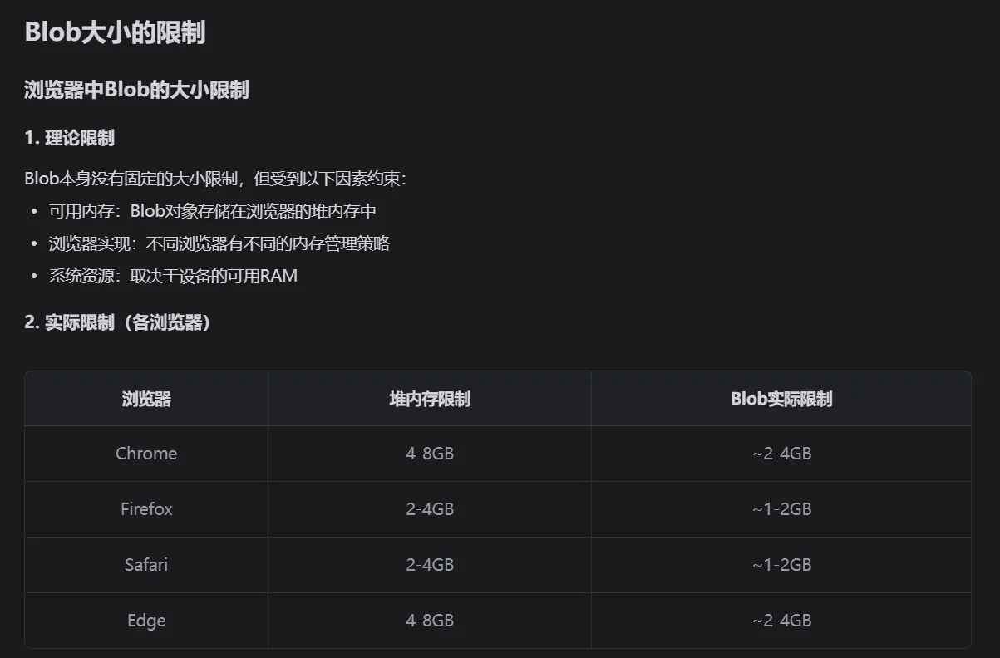
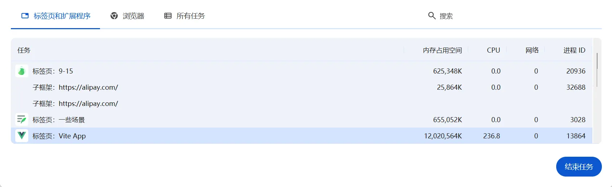
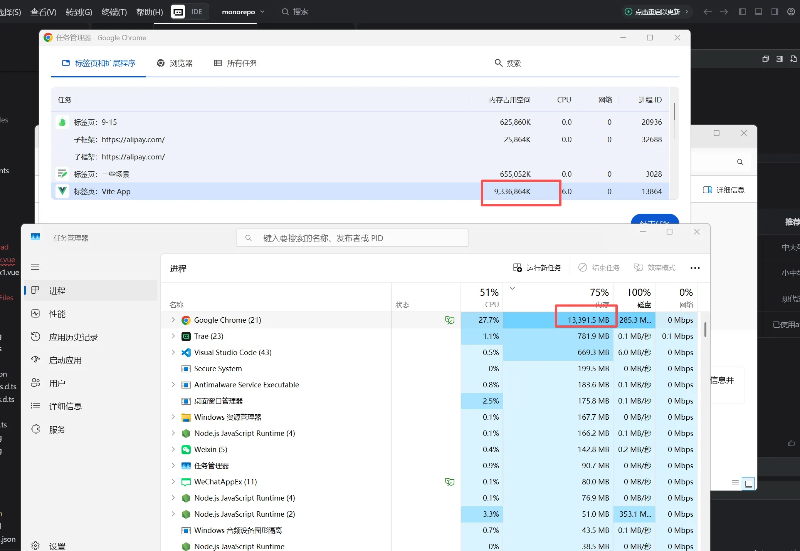
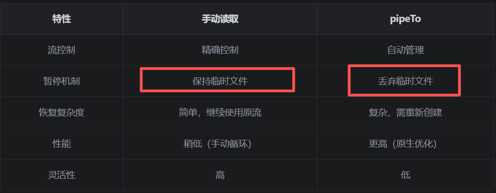

# 文件系统 API

- 链接：https://developer.mozilla.org/zh-CN/docs/Web/API/File_System_API
  &emsp;&emsp;文件系统 API（File System API）——以及通过文件系统访问 API（File System Access API）提供的扩展来访问设备文件系统中的文件——允许使用文件读写以及文件管理功能。任何通过写入流造成的更改在写入流被关闭前都不会反映到文件句柄所代表的文件上。这通常是将数据`写入到一个临时文件`来实现的，然后只有在`写入文件流被正常关闭（close）后`才会用`临时文件替换掉文件句柄所代表的文件（文件越大过程越慢）`。
- 关键API的使用：

```js
关闭文件写入流：WritableStream:
close：生成真正文件
abort：丢弃临时文件（例如pipeTo）
// 选择保存目录
const dirHandle = await window.showDirectoryPicker({
  mode: 'readwrite',
  startIn: 'downloads',
})

// 创建文件句柄:方法返回一个位于调用此方法的目录句柄内带有指定名称的文件的 FileSystemFileHandle
fileHandle = await dirHandle.getFileHandle(fileName, { create: true })

// 创建可写流 - 重新创建文件，确保文件是空的
writable = await fileHandle.createWritable()
// 写入数据到临时文件上的当前指针偏移处写入内容(没有设置从0开始)，有内容就覆盖内容
await writable.write(value)

/**
 * 暂停后续下载：
 * */
const existingFile = await fileHandle.getFile()
const existingArrayBuffer = await existingFile.arrayBuffer()
const position = existingArrayBuffer.byteLength || 0
// 1.
// 暂停后关闭流，继续下载通过相同的把柄然后在创建writable，在设置指针位置
await writable.write({ type: 'seek', position })
await writable.write(test)

// 2.暂停后关闭流，继续下载通过相同的把柄然后在创建writable，先写入现有数据，在写入传入的流
if (existingArrayBuffer.byteLength > 0) {
  await writable.write(existingArrayBuffer)
}
await writable.write(test)

// 3. 暂停后不关闭流：满足用户体验需求 ：希望用户在下载完成前看不到文件
// 继续下载时继续通过原来创建的 writable.write 写入
```

# 文件下载方法：

## 方法一：使用浏览器默认下载

&emsp;&emsp;location.href 、 window.open、a标签
● location.href：对于一些浏览器无法识别的文件格式，可以直接再浏览器地址栏输入url即可触发浏览器的下载功能。对于单文件下载没有什么问题，但是如果下载多文件，点击过快就会重置掉前面的请求
● window.open：对于一些浏览器无法识别的文件格式，可以直接再浏览器地址栏输入url即可触发浏览器的下载功能。

● `适用场景`：浏览器能识别的文件，浏览器触发决策逻辑是否为下载还是预览； 适合大小文件下载；下载信息、控制由浏览器提供.
● **_实现原理_**：location.href/window.open 跳转到文件 URL 时；a连接点击时：发起 HTTP 请求获取文件;内存不会有太多的占用，从网络直接到磁盘，这个数据是直接流向文件的

● `推荐使用`：a链接

```js
<!-- 即使是图片，也会触发下载而非预览 -->
<a href="/image.jpg" download="my-image.jpg">下载图片</a>
<!-- 不指定文件名时，会使用服务器返回的文件名 -->
<a href="/document.pdf" download>下载文档</a>
```

## 方法二：创建a连接的方式

1. URL.createObjectURL() 静态方法会创建一个DOMString，其中包含一个表示参数中给出的对象的URL。这个 URL 的生命周期和创建它的窗口中的document绑定。

```js
downloadFile:function(data,fileName){
    // data为blob格式
    var blob = new Blob([data]);
    var downloadElement = document.createElement('a');
    var href = window.URL.createObjectURL(blob);
    downloadElement.href = href;
    downloadElement.download = fileName;
    document.body.appendChild(downloadElement);
    downloadElement.click();
    document.body.removeChild(downloadElement);
    window.URL.revokeObjectURL(href);
}
```

2. Base64下载（小文件推荐）。readAsDataURL() 方法会读取指定的 Blob 或 File 对象。读取操作为异步操作，当读取完成时，可以从onload回调函数中通过实例对象的result属性获取data:URL格式的字符串（base64编码），此字符串即为读取文件的内容，可以放入a标签的href属性中。

```js
downloadFile:function(data,fileName){
   const reader = new FileReader()
   // 传入被读取的blob对象
   reader.readAsDataURL(data)
   // 读取完成的回调事件
   reader.onload = (e) => {
       let a = document.createElement('a')
       a.download = fileName
       a.style.display = 'none'
       // 生成的base64编码
       let url = reader.result
       a.href = url
       document.body.appendChild(a)
       a.click()
       document.body.removeChild(a)
   }
}
```

&emsp;&emsp;`不推荐使用`，超过20MB点击下载后，数据全部会读取的blob对象，然后在下载。**_会导致页面会短暂的无反应。_**
&emsp;&emsp;`浏览器内存有限`，过大的文件，触发浏览器默认的下载行为很慢；用户体验不好。超过内存限制，会崩溃。`会出现：Array Buffer Allocation Failed 这种错误`


## 方法三：利用streamsaver三方库

&emsp;&emsp;利用service worker 拦截，处理浏览器默认下载，

- 代码：[streamSaver.vue](./streamSaver.vue)
- 缺点：不能实现暂停重新下载

## 方法四：利用Blob+流+Range下载

- 代码：[Blob.vue](./Blob.vue)
- 优点：`可以实现暂停、重新下载等功能`; 可以作为浏览器不支持文件系统api的降级处理；`需要限制下载文件的大小（500Mb-1G）、同时下载的个数`
- 缺点：`浏览器内存有限、分给Blob的内存也有限，操作这个内存会报错，且电脑会变的非常的卡：`
- 数据展示：
  
  

## 方法五：文件系统api+流+Range下载

- 代码：[index.vue](./index.vue)
- 优点：`可以实现暂停、重新下载等功能`;用户体验好（选择下载目录、下载完成前看不到文件，完成后才能看到文件）
- 缺点：`文件系统api有兼容问题`。降级处理可以使用`方法一与方法二`或者提示更换或者升级浏览器
- 使用getReader与pipeTo的区别：
  &emsp;&emsp;pipeTo不适合暂停
  

# 优化

## 背压管理

&emsp;&emsp;背压 ：上游数据产生速度 > 下游数据消费速度，导致内存积压。

- 网络流(快) → 内存缓冲区(积压) → 磁盘写入(慢)
  &emsp;&emsp;`这里背压解决的是：网络流(快) → 内存缓冲区(积压).`
  &emsp;&emsp;window.showSaveFilePicker() 创建的 writable 是 FileStreamWritable 实例（属于 Web Streams API 规范），它并非 “无限制缓存数据再一次性写入磁盘”，而是有一套底层优化逻辑：
  &emsp;&emsp;内置背压（Backpressure）机制： writable.write() 本质是向 “写流缓冲区” 提交数据，但缓冲区有 默认大小限制（不同浏览器实现略有差异，通常在几 MB 到几十 MB 之间）。
  &emsp;&emsp;当缓冲区即将满时，write() 会返回一个 Promise，这个 Promise 会在缓冲区 “腾出空间”（即数据被实际写入磁盘）后才 resolve,再发起下一个 chunk 的下载和写入。“异步写入”≠“无限缓存”：

### TransformStream 的背压机制

- 重点 ： transform 方法的调用频率会根据下游的处理能力自动调节！
- 背压传播机制：

```js
[网络流] → [TransformStream] → [手动读取] → [磁盘写入]
    ↑           ↑                  ↑           ↑
   快速        自动调节           等待        慢速

```

- 实际应用场景`(中间件的角色)`

```js
1. 进度监控
const progressTransform = new TransformStream({
  transform(chunk, controller) {
    // 统计数据量
    totalBytes += chunk.byteLength
    updateProgressBar(totalBytes)

    // 原样传递数据
    controller.enqueue(chunk)
  }
})
2. 数据压缩
const compressionTransform = new TransformStream({
  transform(chunk, controller) {
    // 压缩数据
    const compressedChunk = compress(chunk)

    // 传递压缩后的数据
    controller.enqueue(compressedChunk)
  }
})
3. 数据加密
const encryptionTransform = new TransformStream({
  transform(chunk, controller) {
    // 加密数据
    const encryptedChunk = encrypt(chunk)

    // 传递加密后的数据
    controller.enqueue(encryptedChunk)
  }
})
4. 数据过滤
const filterTransform = new TransformStream({
  transform(chunk, controller) {
    // 过滤特定数据
    if (isValidChunk(chunk)) {
      controller.enqueue(chunk)  // 只传递有效数据
    }
    // 无效数据被丢弃（不调用 enqueue）
  }
})

## 关键理解点
1.数据流动 ： chunk 进来 → 处理 → controller.enqueue() 出去
2.必须调用 enqueue ：否则数据会丢失
3.异步处理 ： transform 方法可以是 async
4.背压处理 ： TransformStream 自动处理上下游速度差异
5.链式处理 ：可以串联多个 TransformStream

response.body
  .pipeThrough(progressTransform)    // 进度监控
  .pipeThrough(compressionTransform) // 数据压缩
  .pipeThrough(encryptionTransform)  // 数据加密
  .getReader()                       // 最终读取
```

### 实现原理

- 手动实现一个背压管理：
  如果磁盘写入速度 < 网络接收速度，数据会在内存中积压。那么减少网络接收速度就行

```js
private async readStreamWithBackpressure(): Promise<void> {
  const maxBufferSize = 1024 * 1024 // 1MB 缓冲区
  let bufferSize = 0

  try {
    while (true) {
      if (this.download.status === 'paused') break

      // 检查缓冲区大小
      if (bufferSize > maxBufferSize) {
        await new Promise(resolve => setTimeout(resolve, 10)) // 短暂等待
        continue
      }

      const { done, value } = await this.reader.read()
      if (done) break

      if (value) {
        bufferSize += value.length

        // 异步写入，不阻塞读取
        this.writable.write(value).then(() => {
          bufferSize -= value.length
        })

        this.download.downloadedSize += value.length
        this.updateProgress()
      }
    }
  } catch (error) {
    console.log('背压控制错误:', error)
  }
}
```

### 代码中已经接实现：

代码：[index.vue](./index.vue)readStream方法：
&emsp;&emsp;await this.writable.write(value) 这里只能写入完了后才能去拿数据

```js
  private async readStream(): Promise<void> {
      if (!this.reader || !this.writable) return
      try {
        while (true) {
          // 检查是否暂停
          if (this.download.status === 'paused' || this.download.status === 'cancelled') {
            console.log('检测到暂停信号，停止读取')
            break
          }
          // 当内部缓冲区满时，ReadableStream 会自动：
          // 1. 暂停从网络接收数据
          // 2. reader.read() 会等待直到有空间
          // 3. 网络层收到背压信号，减缓发送速度
          const { done, value } = await this.reader.read()
          if (done) {
            // 下载完成
            await this.writable.close()
            this.writable = null
            this.download.status = 'completed'
            this.download.progress = 100
            break
          }

          if (value) {
            // 写入数据到文件
            console.log('this.writable')
            await this.writable.write(value)
            // 更新下载进度
            this.download.downloadedSize += value.length
            this.updateProgress()
          }
        }
      } catch (error) {
        console.log('write:', error)
      }
    }

```

## 兼容处理

&emsp;&emsp;文件系统不兼容的时候，就需要沟通换成其它4种方法

## Range 请求 vs 切片下载

&emsp;&emsp;为什么选择文件下载通常使用 Range 请求而不是切片方式：

- Range 请求

```js
1. 简单性: 实现切片、错误处理、分片下载非常简单，只需要设置 startSize-endSize
2. 可靠性: 设置为'Range':0- ；每次推流的块的大小，取决于网络传输的分包机制
网络数据传输时，数据会被分割成不同大小的数据包（TCP segments），这些数据包的大小取决于：
- MTU（最大传输单元） ：通常为1500字节
- 网络拥塞控制 ：网络状况会影响包大小
- 服务器缓冲区 ：服务器端的缓冲区大小
- 浏览器缓冲区 ：浏览器内部的缓冲区处理

3. 内存使用：流式处理，内存使用恒定，可以配合文件系统API，写入一块儿在拿一块流。
4. 服务器压力：单个连接，对服务器友好
```

- 切片下载

```js
1. 相较于复杂：实现切片、错误处理、分片下载需要许多额外的代码
// 复杂的协调逻辑
async downloadWithChunks() {
  const chunkSize = 1024 * 1024 // 1MB
  const totalChunks = Math.ceil(fileSize / chunkSize)
  const chunks = []

  // 需要管理多个并发请求
  for (let i = 0; i < totalChunks; i++) {
    const start = i * chunkSize
    const end = Math.min(start + chunkSize - 1, fileSize - 1)
    chunks.push(downloadChunk(start, end))
  }

  // 需要等待所有片段完成并按顺序合并
  const results = await Promise.all(chunks)
  return mergeChunks(results) // 复杂的合并逻辑
}

2. 内存使用：需要在内存中缓存多个片段；大文件可能导致内存溢出，需要做缓冲区处理
- 占用内存太大的解决方案？创建一个缓冲区（例如数组里面的size不能超过2G），超过及阻塞请求获取切片，当有合适的空间在继续请求。

3. 切片下载 ：多个并发连接，增加服务器负载，需要做并发控制处理（一般3个）

```
